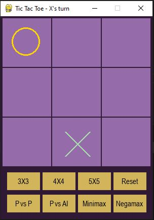

## Tic Tac Toe using Minimax and Negamax algorithms
This tic tac toe game uses pygame to implement the minimax and negamax algorithms. To play against AI, click P vs AI. 
The minimax algorithm is much better than negamax...
This game can be played on 3x3, 4x4, or 5x5

